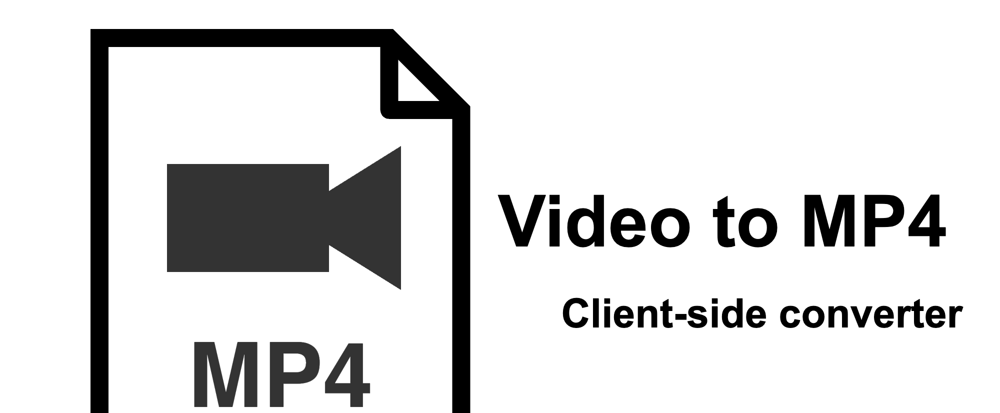

# Video to MP4 Converter

A purely client-side web application to convert any video file to MP4 format.

**Available at: [video-to-mp4.client-side.app](https://video-to-mp4.client-side.app)**

## Features

- **Client-side only**: No video files are uploaded to any server. All processing happens right in your browser.
- **Privacy focused**: Your files never leave your device.
- **Universal compatibility**: Converts various video formats (WebM, MKV, AVI, etc.) to the widely supported MP4 format.
- **Powered by ffmpeg.wasm**: Uses the power of FFmpeg compiled to WebAssembly.

## How to Use

1.  Open the application in your browser.
2.  Click "Select a video file" and choose the video you want to convert.
3.  Click "Convert to MP4".
4.  Wait for the conversion to finish.
5.  Preview the result and click "Download MP4" to save the file.

## License

[MIT](LICENSE)
